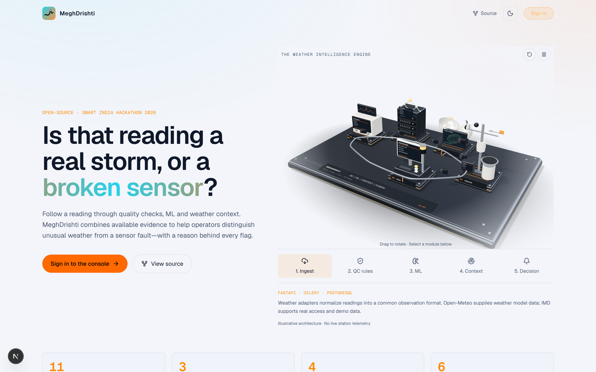
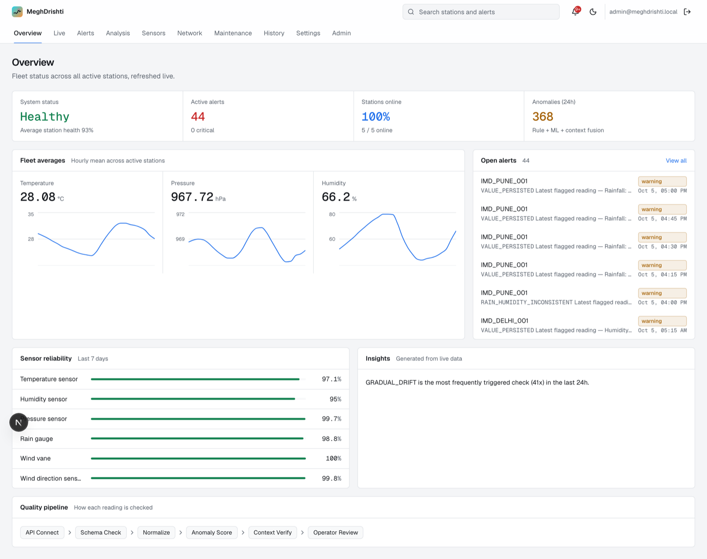
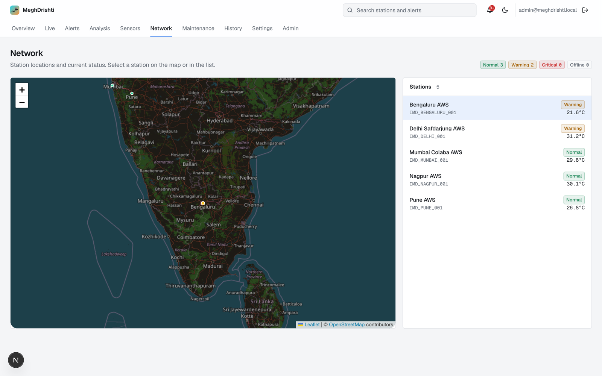
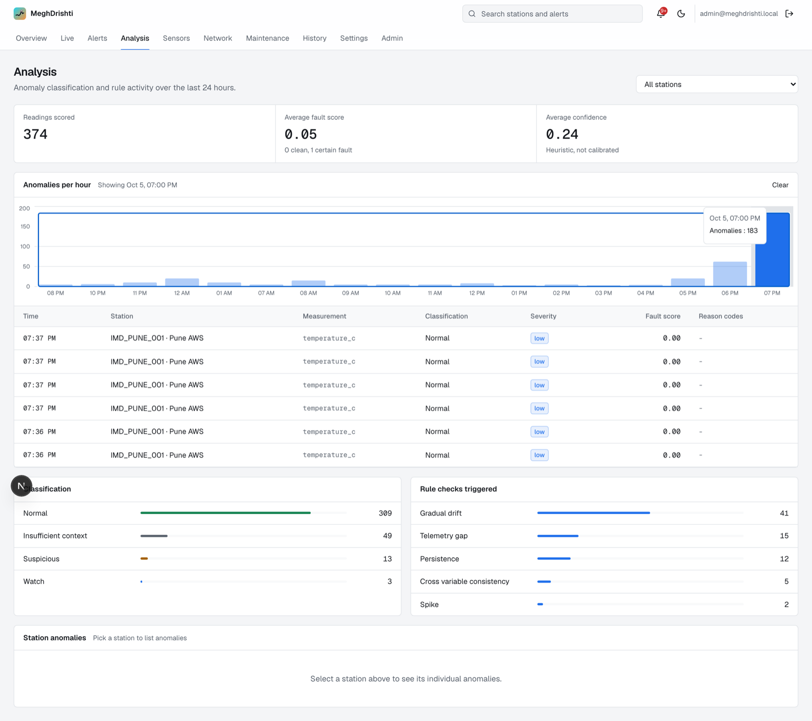
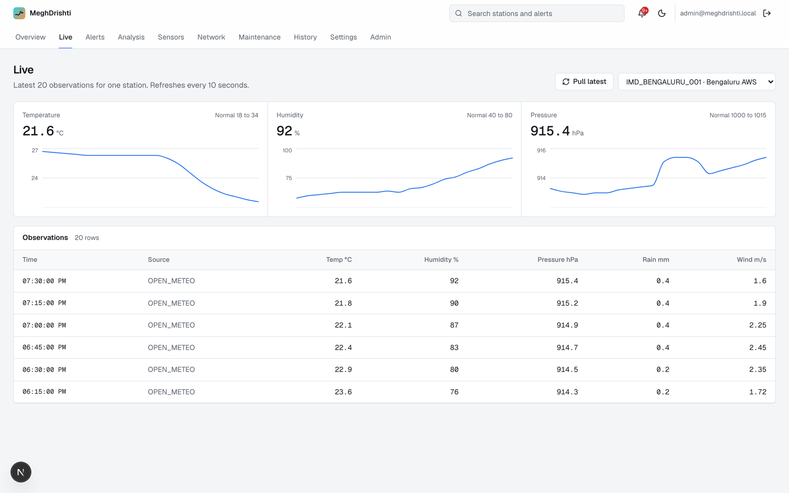
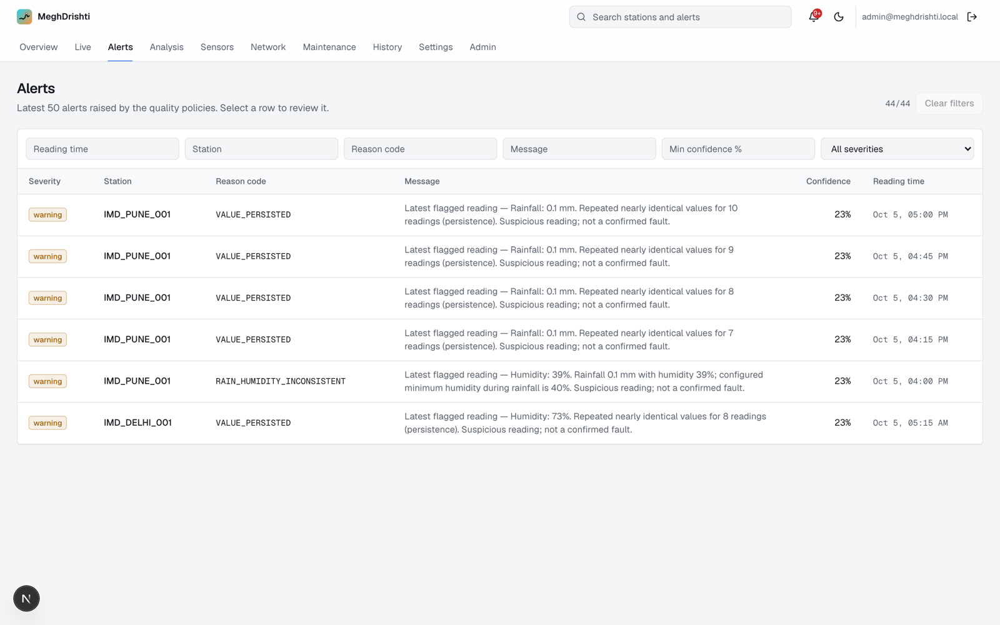
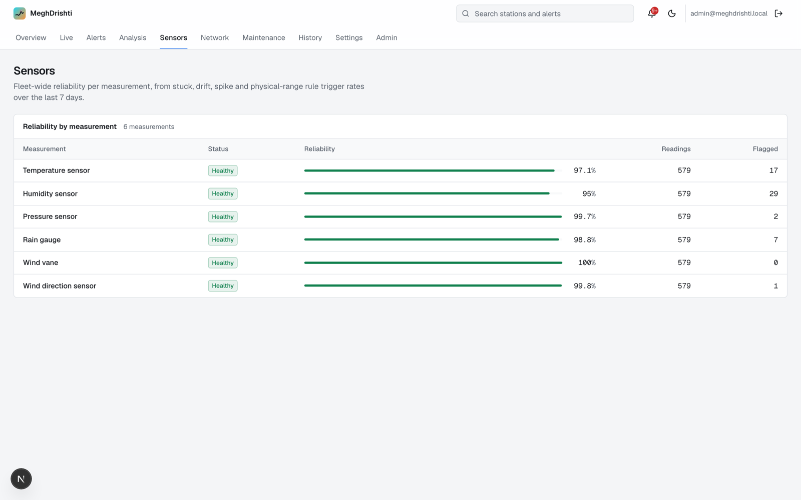
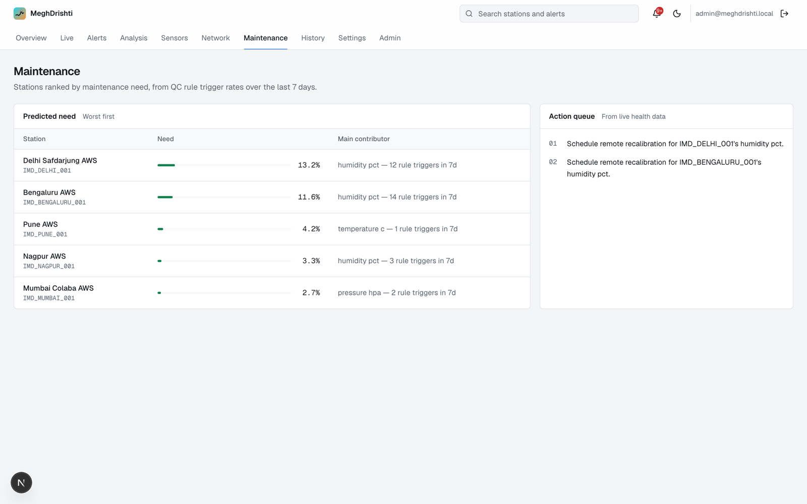
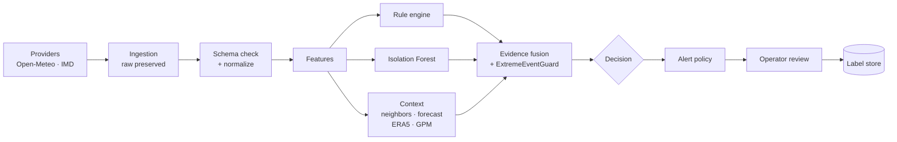

<div align="center">


# MeghDrishti

**Tell a real storm from a broken sensor.**

AI/ML quality control for Automatic Weather Stations. MeghDrishti flags suspicious readings,
checks them against independent weather context, and separates genuine extreme weather
from sensor faults, drift, spikes and telemetry gaps. It never decides on statistical extremity alone.


[Screenshots](#a-look-inside) · [How it works](#how-it-works) · [Quickstart](#quickstart) · [Data sources](#data-sources) · [Backend docs](meghdrishti-backend/README.md)

<br />



</div>

---

## Why MeghDrishti

A weather station reports 48 °C. Is it a heatwave or a sensor sitting in the sun?
Classic QC either throws away real extremes or lets faulty sensors through.
MeghDrishti treats every unusual reading as a question and answers it with evidence:

- **11 rule checks** for stuck values, spikes, drift, dropouts, physical impossibilities and gaps
- **Isolation Forest** scoring on engineered features, never raw values
- **Independent context** from nearby stations, forecasts, ERA5 reanalysis and NASA GPM satellite rain
- **Evidence fusion** with a guard that refuses to call an extreme "fake" when the context backs it up
- **Operator review loop**: every decision is explainable, and every review becomes a label

---

## A look inside

### Overview
Fleet health, live averages, open alerts and sensor reliability on one screen.



<table>
  <tr>
    <td width="50%">
      <b>Alert review</b><br />
      Why it was flagged, the readings behind it, and one-click operator verdicts.<br /><br />
      
    </td>
    <td width="50%">
      <b>Network</b><br />
      Every station on the map with its live status and temperature.<br /><br />
      
    </td>
  </tr>
  <tr>
    <td width="50%">
      <b>Analysis</b><br />
      Classification mix, rule activity, and click-through anomalies per hour.<br /><br />
      
    </td>
    <td width="50%">
      <b>Live</b><br />
      15-minute readings per station, with a one-click <i>Pull latest</i> catch-up.<br /><br />
      
    </td>
  </tr>
  <tr>
    <td width="50%">
      <b>Alerts</b><br />
      Filter by station, reason code, confidence and severity.<br /><br />
      
    </td>
    <td width="50%">
      <b>Sensors</b><br />
      Reliability per measurement from QC trigger rates.<br /><br />
      
    </td>
  </tr>
  <tr>
    <td colspan="2">
      <b>Maintenance</b><br />
      Stations ranked by maintenance need, with an action queue.<br /><br />
      
    </td>
  </tr>
</table>


---

## How it works



Every reading ends up as one of:

| Classification | Meaning |
|---|---|
| `NORMAL` | Nothing unusual |
| `WATCH` | Mildly unusual, keep an eye on it |
| `SUSPICIOUS` | Unusual and unexplained |
| `PROBABLE_SENSOR_FAULT` | Rules or model point at the instrument |
| `LIKELY_GENUINE_EXTREME` | Unusual, but independent context agrees it is real weather |
| `INSUFFICIENT_CONTEXT` | Unusual, and there is no independent evidence to decide either way |

Raw observations are never mutated. Rule, ML and context outputs are stored separately before fusion,
so every alert can show exactly why it was raised.

---

## Quickstart

**Prerequisites:** Node.js, Python 3.12+, Homebrew and [`uv`](https://docs.astral.sh/uv/).

```bash
# one-time setup
brew install postgresql@16 redis
cd meghdrishti-backend
uv venv --python 3.12 .venv
uv pip install --python .venv/bin/python -e ".[dev]"
test -f .env || cp .env.example .env
cd ..
npm install
```

```bash
npm run dev      # start everything
npm run status   # what's running
npm run stop     # stop everything
```

| Service | URL |
|---|---|
| App | http://localhost:3000 |
| API + Swagger | http://localhost:8000/docs |

`npm run dev` starts dedicated Postgres and Redis instances, FastAPI, one Celery worker,
Celery Beat and Next.js. State and logs live in the ignored `.local/` folder.
Ports 5432, 6379, 8000 and 3000 must be free.

> **Running on a laptop?** The scheduler only runs while the machine is awake.
> After sleep, open **Live** and click **Pull latest** to backfill the last 24 hours.

<details>
<summary><b>More on local operation</b></summary>

- Celery Beat schedules ingestion every 15 minutes, the station roster refresh daily at 03:00 UTC,
  model candidate training Sunday 03:00 UTC, and calibration proposals Monday 04:00 UTC.
  Run only one Beat instance.
- The single worker processes jobs sequentially, so slow ingestion or training can delay QC.
  It is meant for laptop development, not as a throughput claim.
- Logs: `.local/logs/` (API, worker, beat, frontend), `.local/postgres.log`, `.local/redis/redis.log`.
- API shutdown allows 15 seconds for active requests. Workers finish their current task;
  if that takes more than 60 seconds, run `stop` again.
- Historical backfill (example: 7 days):

  ```bash
  cd meghdrishti-backend
  .venv/bin/celery -A app.workers.celery_app call \
    app.workers.schedule_tasks.run_scheduled_job --queue schedule \
    --args '["ingest"]' --kwargs '{"window_minutes":10080,"sources":["OPEN_METEO"]}'
  ```

- Prometheus and Grafana are optional and not started by the launcher. Configs live in
  `meghdrishti-backend/monitoring/`.
- Optional legacy Airflow DAGs can replace Beat. Never run both on the same jobs.
- Shutdown check: `meghdrishti-backend/.venv/bin/python scripts/verify_local_shutdown.py`.

</details>

---

## Data sources

| Source | Role | What it covers | Setup |
|---|---|---|---|
| **Open-Meteo** | Primary feed | All measurements, every 15 minutes | No key needed |
| **NASA GPM** (IMERG Early) | Context | Rainfall, about 4 hours behind real time | Earthdata or PPS login in `.env` |
| **ERA5** (Copernicus) | Context | Temperature, pressure, humidity, about 5 days behind | CDS key + accepted licence |
| **NOAA GHCN** | Station network | Daily summaries from nearby stations | Token in `.env` (sparse recent coverage for India) |
| **IMD** | Primary feed | Real Indian station observations | Adapter built, waiting for API access |

> Open-Meteo is model output, so it is never used to confirm itself. Until real sensor data or
> independent context is available, recent readings can show `INSUFFICIENT_CONTEXT`. That is the system
> being honest, not a bug. See [`queue/imd-integration.md`](queue/imd-integration.md) for the IMD status.

---

## Tech stack

| Layer | Tools |
|---|---|
| Frontend | Next.js 16 (App Router, Turbopack), React 19, Tailwind 4, Recharts, Leaflet, Three.js, Framer Motion |
| API | FastAPI, Pydantic, SQLAlchemy (async), Alembic, JWT + Argon2, RBAC with 5 roles |
| Pipeline | Celery + Beat, Redis Pub/Sub, WebSockets |
| ML | scikit-learn Isolation Forest with a candidate registry and explicit activation |
| Context | gpm-api (NASA IMERG), cdsapi (ERA5), NOAA NCEI |
| Observability | Structured JSON logs, Prometheus metrics, optional Grafana dashboard |

---

## Project structure

```
MeghDrishti/
├── src/
│   ├── app/
│   │   ├── page.tsx              # public landing page with the 3D pipeline hero
│   │   ├── login/                # Google Sign-In + email/password
│   │   └── (app)/                # signed-in console (overview, live, alerts, ...)
│   ├── components/
│   │   ├── console/              # console design system: header, panels, charts
│   │   └── ui/agentic-factory-3d.tsx
│   └── lib/                      # API client, auth, live-data hooks
├── meghdrishti-backend/          # FastAPI + Celery backend  → see its README
├── scripts/local.sh              # native start / stop / status
├── docs/screenshots/             # images used in this README
└── queue/                        # items blocked on external processes
```

---

## Sign-in and roles

- The landing page at `/` is public. Everything in the console needs sign-in;
  signed-out visitors are sent back to `/`.
- **Google Sign-In** is the main path. It needs `GOOGLE_CLIENT_ID` (backend) and
  `NEXT_PUBLIC_GOOGLE_CLIENT_ID` (frontend). A first-time Google user gets a `VIEWER` account.
- **Email and password** works for the seeded demo admin.
- **Roles:** `VIEWER`, `OPERATOR`, `MAINTENANCE`, `SCIENTIST`, `ADMIN`.
  Settings data needs `SCIENTIST` or `ADMIN`; the Admin page and **Pull latest** need `ADMIN`.

---

## Status and honesty notes

- **Real data only.** Every number in the console comes from a live backend query.
  `src/lib/mock-data.ts` holds only types, colours and static reference text.
- **Tests.** The backend suite passes 120 tests. A synthetic-source integration test proves raw → anomaly
  → alert → station health → WebSocket event.
- **ML.** Isolation Forest models are trained as candidates and must be activated explicitly.
  Candidates trained on forecast data are diagnostic only and cannot be activated; that needs real
  sensor data with chronological holdout evaluation. ML accuracy is unknown until operator labels exist.
- **Decisions.** 240 controlled synthetic scenarios match their intended classifications
  ([decision evaluation](meghdrishti-backend/docs/decision-accuracy.md)). This is diagnostic, not field accuracy.
- **Audits.** [Provider and ML audit](meghdrishti-backend/docs/provider-ml-audit.md) ·
  [Stored alert audit](meghdrishti-backend/docs/alert-audit.md)

<details>
<summary><b>Security notes: feeds and browser origins</b></summary>

- `CORS_ORIGINS` accepts exact HTTP(S) origins only, with no paths or wildcards.
  Writes from an unapproved origin are rejected before reaching API handlers.
- There is no public observation-upload endpoint. Ingestion uses configured adapters only.
- Each normalized record must match its adapter's source and requested station, and fall inside the requested window.
- Rejected payloads stay in raw storage with a reason and never reach normalized observations.
- These checks cannot detect every plausible forged reading from a compromised provider,
  or protect against an attacker who already controls the database.

</details>

<details>
<summary><b>3D pipeline hero (landing page)</b></summary>

- Component: `src/components/ui/agentic-factory-3d.tsx`, used by `src/components/WeatherPipelineHero.tsx`.
- Five selectable modules: ingestion, QC, ML, context and decision fusion.
- Rendering is capped at 2× pixel density and 30 fps to bound GPU work.
- Reduced motion pauses the simulation. Pause, reset and module controls are keyboard accessible.
- Labels describe the architecture, not live telemetry.

</details>

---

<div align="center">

Built for **Smart India Hackathon 2026** · Original pitch deck: `SIH2026-IDEA-MeghDrishti-Winner-Style-v2_ Edit (1).pptx.pdf`

</div>
